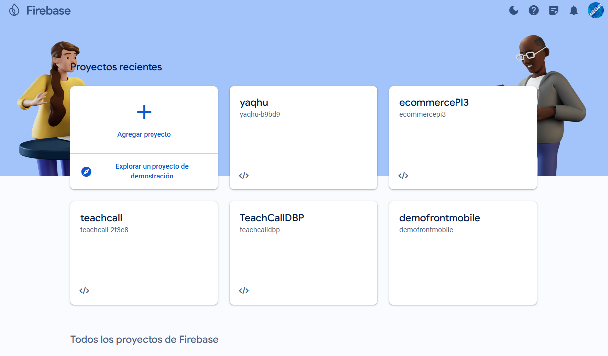
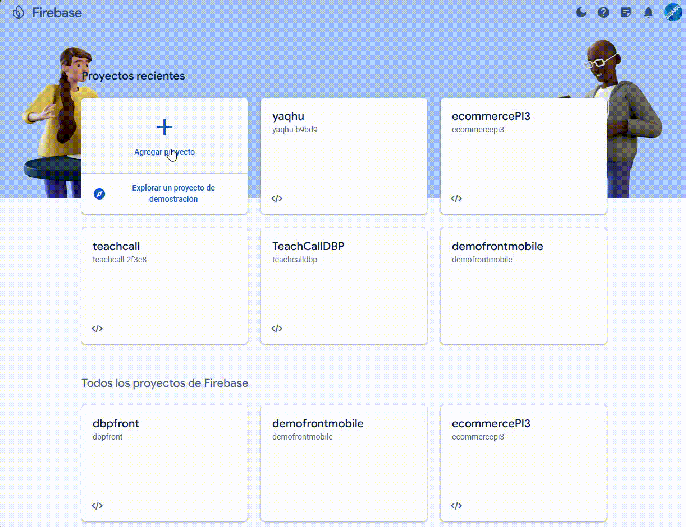
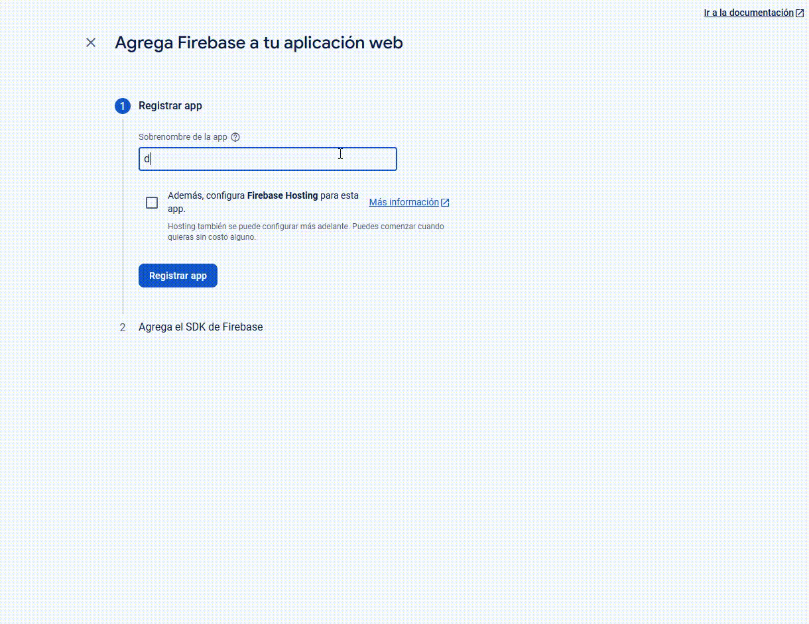
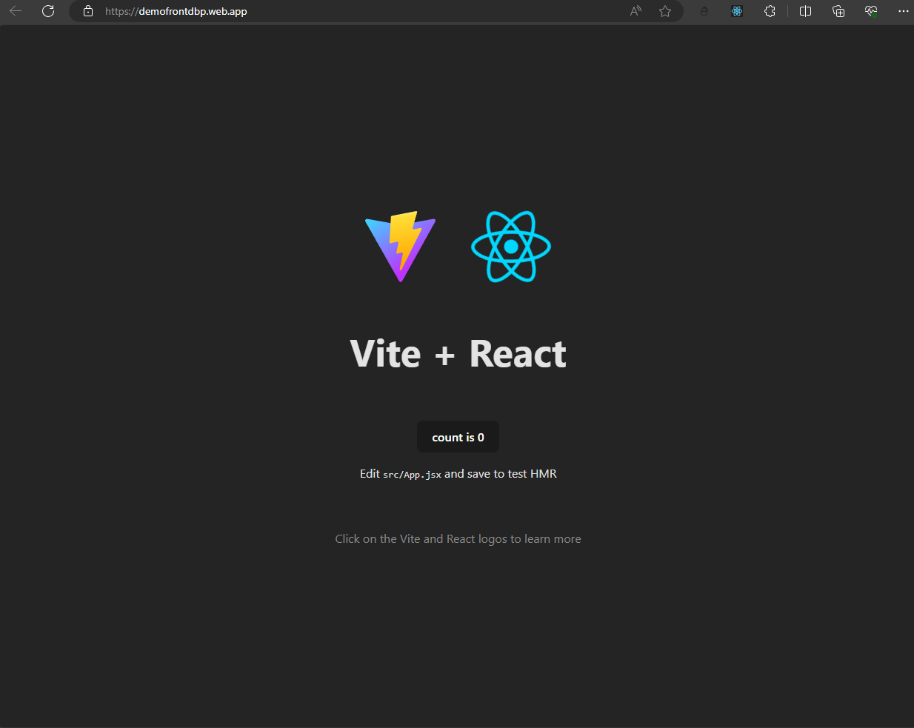
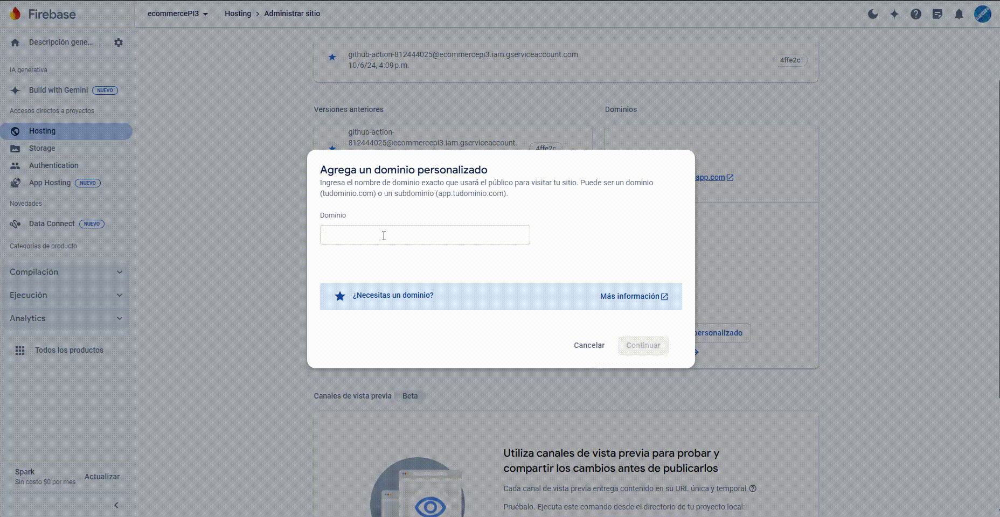
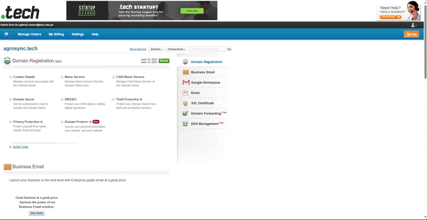
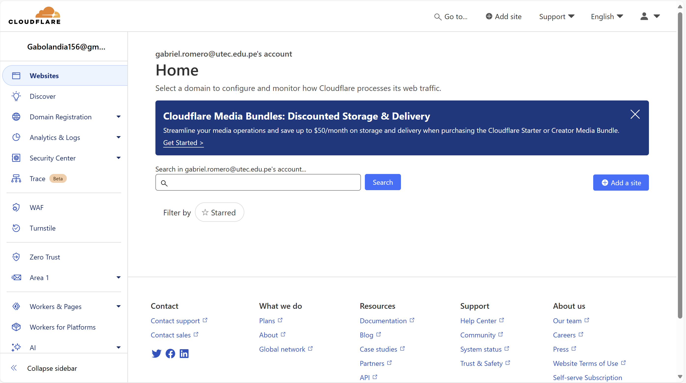
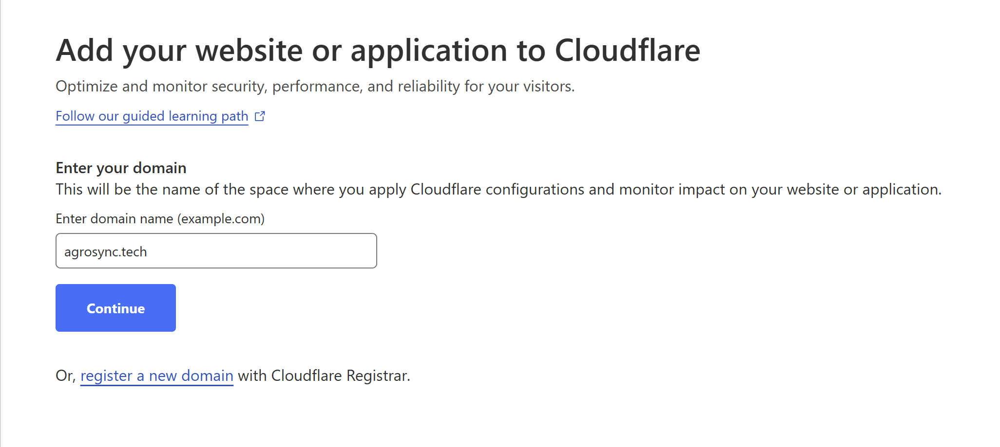
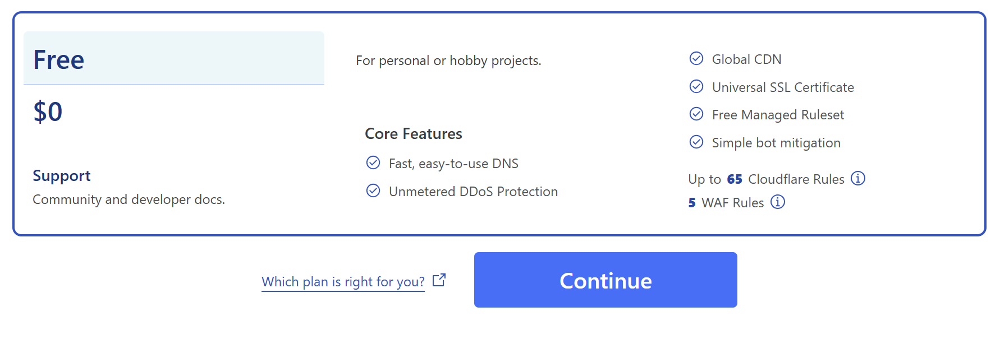
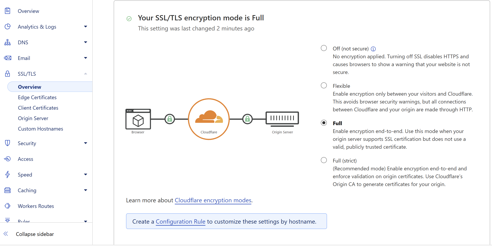

# 🌐 Firebase - Cloudflare - .TECH 🚀

Bienvenidos al laboratorio de Cloud Computing 2 del curso de Desarrollo Basado en Plataformas CS2031 de la Universidad de Ingeniería y Tecnología (UTEC). En esta sesión, aprenderemos a desplegar una aplicación web desarrollada en Node.js en Google Firebase.

Siempre hemos visto que las aplicaciones web tienen un dominio personalizado, por ejemplo, `www.google.com`, `www.facebook.com`, `www.youtube.com`, etc. Estos dominios personalizados son muy importantes para que los usuarios puedan acceder a nuestra aplicación web. En este laboratorio, aprenderemos a configurar un dominio personalizado en Google Firebase.

DNS (Domain Name System) es un sistema de nomenclatura jerárquico descentralizado para dispositivos conectados a redes IP como Internet o una red privada. La mayoría de los servicios de DNS son operados por proveedores de servicios de Internet (ISP) o por empresas privadas. En este laboratorio, vamos a aprender a configurar un dominio personalizado en Google Firebase y a agregar Cloudflare para obtener un certificado SSL.

Anteriormente, aprendimos a desplegar APIs Restful en Amazon Web Services (AWS) usando Elastic Container Service (ECS) y Elastic Container Registry (ECR). Quizás se pregunten por qué ahora vamos a desplegar en Google Firebase y no en AWS. La respuesta es simple: Firebase nos simplifica el proceso de despliegue de nuestra aplicación web, ya que no necesitamos preocuparnos por la infraestructura ni por el escalado de la aplicación. Firebase nos permitirá desplegar nuestra aplicación web en pocos minutos.

Este concepto de combinar aplicaciones en diferentes proveedores de servicios en la nube se conoce como **multi-cloud**. En este laboratorio, vamos a combinar los servicios de Google Firebase con los de AWS.

## 🎯 Objetivos

- Aprender a desplegar una aplicación web en Google Firebase.
- Canjear nuestro dominio del GitHub Student Developer Pack.
- Configurar un dominio personalizado en Google Firebase.
- Agregar Cloudflare a nuestro dominio personalizado para obtener un certificado SSL.

## 📋 Pre-requisitos

- Tener una cuenta de Google.
- Tener una cuenta de GitHub verificada con GitHub Student Developer Pack.

## Tutorial

### 1. Build en el frontend

Primero, hemos estado trabajando usando Vite, un bundler que nos permite trabajar con React, Vue, Svelte, etc. Esto nos da facilidades para trabajar con aplicaciones web modernas, entre ellas React.

Al ser una aplicación Node.js, esta se puede construir, es decir, generar los archivos estáticos que se van a servir en el servidor.

#### ¿Por qué es importante hacer un build?

Cuando trabajamos con aplicaciones web, es importante hacer un build de nuestra aplicación para que los navegadores puedan interpretar nuestro código. Un build es un proceso que toma nuestro código fuente y lo transforma en un formato que los navegadores puedan entender.

Para hacer un build de nuestra aplicación, ejecutamos el siguiente comando:

```bash
npm run build
```

Este comando generará una carpeta `dist` en la raíz de nuestro proyecto. Esta carpeta contiene los archivos estáticos que se van a servir en el servidor.

### 2. Google Firebase

Google Firebase es una plataforma de desarrollo de aplicaciones móviles y web desarrollada por Firebase Inc. en 2011, luego adquirida por Google en 2014. Firebase es una plataforma que nos permite desarrollar aplicaciones de alta calidad, crecer nuestra base de usuarios y ganar dinero. Firebase nos proporciona una amplia gama de servicios, como autenticación, bases de datos en tiempo real, almacenamiento en la nube, mensajería en la nube, entre otros.

### 2.1. Ingresar a Google Firebase

Debemos ingresar a [Google Firebase](https://firebase.google.com/) y seleccionar la opción `Comenzar` nos logeamos con nuestra **CUENTA PERSONAL DE GOOGLE**, no con la cuenta de la universidad:


### 2.2. Consola de Firebase

Al igual que en AWS, Google Firebase tiene una consola donde podemos administrar nuestros proyectos. Para ingresar a la consola de Firebase, hacemos clic en [`Ir a la consola`](https://console.firebase.google.com/):



### 2.3. Crear un Proyecto en Firebase

#### Paso 1: Ingresar a la Consola de Firebase

1. **Acceder a Firebase:** Abre la [consola de Firebase](https://console.firebase.google.com/).
2. **Agregar un Proyecto:** Haz clic en el botón `Agregar un proyecto`.

#### Paso 2: Configurar el Proyecto

1. **Nombre del Proyecto:** Ingresa el nombre de tu proyecto y haz clic en `Continuar`.
2. **Google Analytics:** Selecciona la opción para habilitar Google Analytics.
3. **Cuenta de Google Analytics:** Selecciona la cuenta de Google Analytics predeterminada para Google Firebase y haz clic en `Continuar`.

#### Paso 3: Crear el Proyecto

1. **Crear Proyecto:** Haz clic en el botón `Crear proyecto`.
2. **Espera:** Espera unos segundos mientras se crea el proyecto.
3. **Continuar:** Una vez creado, haz clic en `Continuar`.

Ahora, tu proyecto está listo para comenzar a trabajar.



### 2.4. Configurar una Web App en Firebase

#### Paso 1: Seleccionar Plataforma Web

1. **Menu Principal:** En el menú principal de Firebase, selecciona la opción `Web`.
2. **Registrar App:** Haz clic en el ícono `</>` para comenzar el registro de tu aplicación web.

#### Paso 2: Configurar la App

1. **Nombre de la App:** Ingresa el nombre que desees para tu aplicación.
2. **Activar Hosting:** Asegúrate de activar la opción de hosting.

#### Paso 3: Instalar SDK

1. **Copiar Comando npm:** En el paso 2 de SDK, copia el comando proporcionado (`npm install firebase`).
2. **Ejecutar Comando:** Abre la terminal de tu proyecto y ejecuta el comando copiado.

#### Paso 4: Instalar Firebase CLI

1. **Copiar Comando CLI:** Copia el comando para instalar Firebase CLI (`npm install -g firebase-tools`).
2. **Ejecutar Comando:** Abre la terminal y ejecuta el comando copiado para instalar Firebase CLI.


#### Paso 5: Implementar Hosting

1. **Siguiente:** En la sección de implementación de hosting, haz clic en `Siguiente`.
2. **Finalizar:** Completa el proceso haciendo clic en `Finalizar`.

Ahora tu aplicación web está configurada y lista para ser utilizada con Firebase Hosting.



### 2.5. Configurar el Proyecto y Desplegar la Aplicación

#### Paso 1: Iniciar Sesión en Firebase CLI

1. **Comando de Login:** En la terminal, ingresa el siguiente comando para iniciar sesión en Firebase CLI:
    ```bash
    firebase login
    ```
2. **Permitir Informes:** Cuando se te pregunte "Allow Firebase to collect CLI and Emulator Suite usage and error reporting information? (Y/n)", responde `y`.
3. **Iniciar Sesión:** Se abrirá una ventana en tu navegador para que inicies sesión con tu cuenta de Google. Otorga los permisos necesarios.

    

4. **Confirmación:** La terminal mostrará un mensaje confirmando que has iniciado sesión exitosamente:
    ```bash
    Success! Logged in as [correo]
    ```

    

#### Paso 2: Inicializar el Proyecto

1. **Comando de Inicialización:** En la terminal, ejecuta el siguiente comando para inicializar el proyecto:
    ```bash
    firebase init
    ```

    ```plaintext
    C:\Users\lords\Downloads\DemoFront\demoFrontDBP>firebase init
    
         ######## #### ########  ######## ########     ###     ######  ########
         ##        ##  ##     ## ##       ##     ##  ##   ##  ##       ##
         ######    ##  ########  ######   ########  #########  ######  ######
         ##        ##  ##    ##  ##       ##     ## ##     ##       ## ##
         ##       #### ##     ## ######## ########  ##     ##  ######  ########
    
    You're about to initialize a Firebase project in this directory:
    
      C:\Users\lords\Downloads\DemoFront\demoFrontDBP
    
    ? Are you ready to proceed? Yes
    ```

2. **Seleccionar Características:** Selecciona las características de Firebase que deseas configurar. Para hosting, selecciona `Hosting: Configure files for Firebase Hosting and (optionally) set up GitHub Action deploys`.
    ```plaintext
    === Project Setup
    
    First, let's associate this project directory with a Firebase project.
    You can create multiple project aliases by running firebase use --add,
    but for now we'll just set up a default project.
    
    ? Please select an option: Use an existing project
    ? Select a default Firebase project for this directory: demofrontdbp (demoFrontDBP)
    i  Using project demofrontdbp (demoFrontDBP)
    ```

3. **Configurar Hosting:** Configura las opciones de hosting:
    ```plaintext
    === Hosting Setup
    
    Your public directory is the folder (relative to your project directory) that
    will contain Hosting assets to be uploaded with firebase deploy. If you
    have a build process for your assets, use your build's output directory.
    
    ? What do you want to use as your public directory? dist
    ? Configure as a single-page app (rewrite all urls to /index.html)? Yes
    ? Set up automatic builds and deploys with GitHub? Yes
    +  Wrote dist/index.html
    
    i  Didn't detect a .git folder. Assuming C:\Users\lords\Downloads\DemoFront\demoFrontDBP is the project root.
    i  Authorizing with GitHub to upload your service account to a GitHub repository's secrets store.
    ```

4. **Autorización de GitHub:** Autoriza a Firebase CLI a acceder a tu cuenta de GitHub:
    ```plaintext
    Visit this URL on this device to log in:
    https://github.com/login/oauth/authorize?client_id=89cf50f02ac6aaed3484&state=25494124&redirect_uri=http%3A%2F%2Flocalhost%3A9005&scope=read%3Auser%20repo%20public_repo
    
    Waiting for authentication...
    
    +  Success! Logged into GitHub as gabrielromerod
    ```

5. **Configuración de Workflow:** Configura el flujo de trabajo para las implementaciones automáticas:
    ```plaintext
    ? For which GitHub repository would you like to set up a GitHub workflow? (format: user/repository) gabrielromerod/demoDBPFront
    
    +  Created service account github-action-815419685 with Firebase Hosting admin permissions.
    +  Uploaded service account JSON to GitHub as secret FIREBASE_SERVICE_ACCOUNT_DEMOFRONTDBP.
    i  You can manage your secrets at https://github.com/gabrielromerod/demoDBPFront/settings/secrets.
    
    ? Set up the workflow to run a build script before every deploy? Yes
    ? What script should be run before every deploy? (npm ci && npm run build) 
    ? What script should be run before every deploy? npm ci && npm run build
    
    +  Created workflow file C:\Users\lords\Downloads\DemoFront\demoFrontDBP\.github/workflows/firebase-hosting-pull-request.yml
    ? Set up automatic deployment to your site's live channel when a PR is merged? Yes
    ? What is the name of the GitHub branch associated with your site's live channel? main
    
    +  Created workflow file C:\Users\lords\Downloads\DemoFront\demoFrontDBP\.github/workflows/firebase-hosting-merge.yml
    
    i  Action required: Visit this URL to revoke authorization for the Firebase CLI GitHub OAuth App:
    https://github.com/settings/connections/applications/89cf50f02ac6aaed3484
    i  Action required: Push any new workflow file(s) to your repo
    
    i  Writing configuration info to firebase.json...
    i  Writing project information to .firebaserc...
    
    +  Firebase initialization complete!
    ```

Ahora tu proyecto está configurado y listo para ser desplegado.

Cada vez se haga un `push` a la rama `main`, se desplegará automáticamente en Firebase.


### 2.6. Desplegar la Aplicación

Para desplegar la aplicación, sigue estos pasos:

#### Paso 1: Construir y Desplegar la Aplicación

1. **Construir la Aplicación:** Ejecuta el siguiente comando en la terminal para construir tu aplicación:
    ```bash
    npm run build
    ```
2. **Desplegar la Aplicación:** Luego, despliega la aplicación en Firebase usando el siguiente comando:
    ```bash
    firebase deploy
    ```

   ```plaintext
   C:\Users\lords\Downloads\DemoFront\demoFrontDBP>firebase deploy
   
   === Deploying to 'demofrontdbp'...
   
   i  deploying hosting
   i  hosting[demofrontdbp]: beginning deploy...
   i  hosting[demofrontdbp]: found 1 files in dist
   +  hosting[demofrontdbp]: file upload complete
   i  hosting[demofrontdbp]: finalizing version...
   +  hosting[demofrontdbp]: version finalized
   i  hosting[demofrontdbp]: releasing new version...
   +  hosting[demofrontdbp]: release complete
   
   +  Deploy complete!
   
   Project Console: https://console.firebase.google.com/project/demofrontdbp/overview
   Hosting URL: https://demofrontdbp.web.app
   ```

#### Nota: Despliegue Automático con GitHub Actions

Dado que hemos configurado un GitHub Action, el build y despliegue de la aplicación se realizarán automáticamente cada vez que se haga un push a la rama principal del repositorio en GitHub. No será necesario ejecutar manualmente los comandos de construcción y despliegue.

### Resultados

Una vez desplegada la aplicación, Firebase nos proporcionará una URL para acceder a nuestra aplicación. Esta URL se mostrará en la terminal al finalizar el despliegue, y también puede ser encontrada en la consola de Firebase.



### 3. Configuración de Dominio en .TECH

.TECH es un dominio de nivel superior (TLD) ideal para sitios web relacionados con tecnología, startups, empresas de tecnología y desarrolladores. En este caso, vamos a canjear un dominio .TECH utilizando el GitHub Student Developer Pack.

#### Paso 1: Registro y Verificación

1. **Registrar:** Visita [get.tech](https://get.tech/) y regístrate utilizando tu correo institucional.
2. **Verificar Correo:** Verifica tu correo electrónico siguiendo el enlace que recibirás.

#### Paso 2: Canjear el Dominio

1. **Canjear Dominio:** Abre el siguiente enlace para canjear tu dominio .TECH: [Canjear Dominio .TECH](https://get.tech/github-student-developer-pack).
2. **Buscar Dominio:** Busca un dominio disponible y agrégalo al carrito.
3. **Proceder al Pago:** Procede al pago. Al iniciar sesión con GitHub, la compra se hará automáticamente gratuita.


### 4. Configuración de Dominio en Google Firebase

#### Paso 1: Agregar Dominio Personalizado en Firebase

1. **Agregar Dominio:** En Firebase, ve a la sección de hosting y selecciona la opción de agregar un dominio personalizado.
2. **Ingresar Dominio:** Ingresa el dominio que acabas de comprar. No marques la opción de redirigir el tráfico a `www` y haz clic en continuar.



#### Explicación de Conceptos Técnicos:

- **Firebase Hosting:** Servicio que permite alojar contenido web de manera rápida y segura.
- **Dominio Personalizado:** Un nombre de dominio específico que has registrado y que quieres utilizar para tu aplicación en lugar del dominio predeterminado de Firebase.

#### Paso 2: Verificar Propiedad del Dominio

1. **Agregar Registros DNS:** Agrega los registros que te proporciona Firebase a tu proveedor de DNS para verificar la propiedad del dominio.
2. **Acceder a DNS:** Inicia sesión en [get.tech](https://get.tech/), ve a tu cuenta, accede al dashboard y selecciona el dominio que acabas de comprar en "Manage Orders".
3. **Modificar DNS:** En la sección de DNS, agrega los registros que te pide Firebase.


#### Explicación de Conceptos Técnicos:

- **Registros DNS:** Entradas en un sistema de nombres de dominio que asocian nombres de dominio con direcciones IP u otros recursos.
- **Proveedor de DNS:** Servicio que gestiona los registros DNS de tu dominio.

#### Paso 3: Confirmar y Finalizar

1. **Agregar Registros:** Agrega todos los registros necesarios según las instrucciones de Firebase.



2. **Verificar en Firebase:** Vuelve a Firebase y haz clic en verificar. Aparecerá un mensaje indicando que el dominio se está verificando, lo cual puede tardar hasta 24 horas.


#### Explicación de Conceptos Técnicos:

- **Propagación de DNS:** Tiempo que tardan los registros DNS en actualizarse en todos los servidores DNS alrededor del mundo.

Una vez que el dominio esté verificado, estará completamente configurado y listo para ser utilizado con tu proyecto en Firebase. La propagación puede demorar entre 4 a 24 horas.

Se verá de la siguiente manera en la consola de Firebase Hosting:


Ahora pushea tus cambios a la rama `main` y espera a que se despliegue automáticamente en Firebase.

Listo, tu aplicación web está desplegada en Firebase con un dominio personalizado.

### 5. Agregar Cloudflare

Cloudflare es una empresa de servicios de Internet y una red de entrega de contenido distribuido que ofrece servicios de seguridad y servidores de nombres de dominio. Actúa como un proxy inverso, protegiendo tu sitio web contra diversos ataques y mejorando su rendimiento.

#### Paso 1: Crear una Cuenta en Cloudflare

1. **Crear Cuenta:** Visita [Cloudflare](https://dash.cloudflare.com/sign-up) y crea una cuenta.

#### Explicación de Conceptos Técnicos:

- **Proxy Inverso:** Servidor que intercepta las solicitudes de los usuarios antes de que lleguen al servidor web real.
- **DDoS:** Tipo de ataque que busca hacer que un servicio en línea no esté disponible al abrumar el servidor con una gran cantidad de tráfico.

#### Paso 2: Agregar un Sitio Web

1. **Agregar Sitio Web:** En la sección de agregar un sitio web, ingresa el dominio que acabas de configurar en Firebase y haz clic en `Add Site`.



Colocamos el dominio que configuramos en Firebase.



#### Explicación de Conceptos Técnicos:

- **Dominio:** El nombre de tu sitio web (por ejemplo, example.tech).

#### Paso 3: Seleccionar Plan

1. **Seleccionar Plan:** Selecciona el plan gratuito y haz clic en `Confirm Plan`.



#### Paso 4: Cambiar Servidores de DNS

1. **Cambiar Servidores:** Cloudflare te proporcionará dos servidores de DNS. Cambia los servidores de DNS en tu proveedor de dominio a los servidores de Cloudflare.


Este proceso puede tardar hasta 24 horas en propagarse.

#### Explicación de Conceptos Técnicos:

- **Servidores de DNS de Cloudflare:** Servidores que gestionarán tus registros DNS proporcionando seguridad y rendimiento mejorados.

#### Paso 5: Verificar Configuración

1. **Verificar Configuración:** Verifica que la configuración de Cloudflare esté correcta y que el dominio esté apuntando a los servidores de Cloudflare.

#### Paso 6: Finalizar Configuración

1. **Finalizar Configuración:** Una vez que la configuración esté correcta, tu dominio estará protegido por Cloudflare. Selecciona HTTPS siempre activado.

Luego vamos a SSL/TLS y seleccionamos `Overview` y seleccionamos `Full`.




Finalmente, tu dominio estará protegido por Cloudflare y tendrá un certificado SSL. Además, contarás con protección contra DDoS, ataques de SQL Injection, spam y bots maliciosos.

Gracias a Cloudflare, tu aplicación web estará protegida y segura.